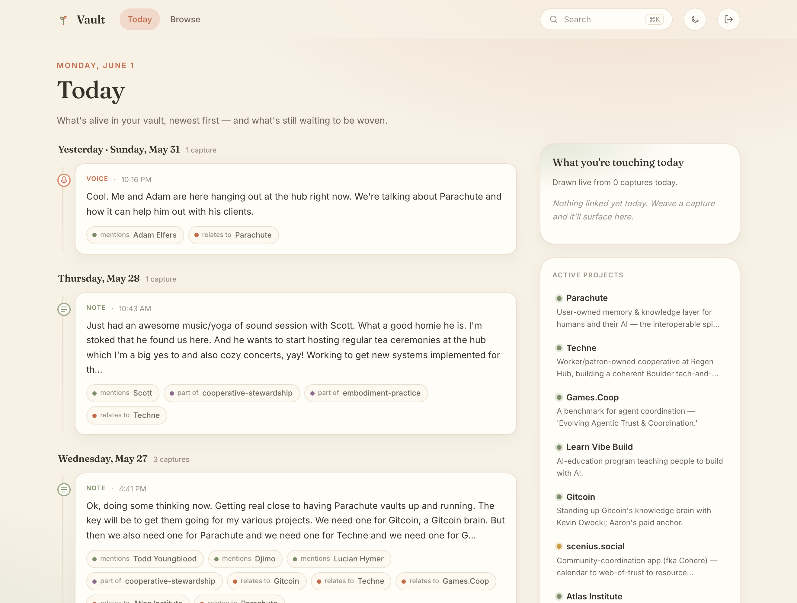

# Vault — a quiet garden for the mind

A personal, single-page thinking surface for your **Parachute Vault**. It reads
your captures (journal entries), entities (projects, people, places, threads,
practices, tools, references, organizations, seeds), and the links that weave
them together — and gives you a calm, *Today-first* place to see what's alive and
to weave loose captures into your graph.

It is a **static SPA**. No backend, no server of its own — it talks directly to
your vault over HTTP from your browser. Deploy it once to GitHub Pages; it works
against your local vault or your Tailscale URL, whichever you paste in.



## What it does

- **Today** (`/`) — a timeline spine of your recent captures grouped by day, each
  with a type glyph (note / voice / dream), a preview, and navigable chips for
  every entity it links to. Alongside it:
  - **What you're touching today** — derived live from today's captures' links
    (projects / threads / people), no LLM, just your data reflected back.
  - **A board rail** of active projects + living threads (dormant/archived hidden
    behind a toggle).
  - **A "To weave" tray** — recent *unwoven* captures (`has_links=false`). Open one
    to search your entities and add links, or create a new entity inline.
- **Capture detail** (`/capture/:id`) — full markdown content, voice playback when
  present, `[[wikilinks]]` rendered as in-app links, and all links as chips.
- **Entity detail** (`/entity/:path`) — editable summary, type-specific fields,
  every linked capture across time, and related entities (co-occurrence on shared
  captures).
- **Browse** (`/browse`) — all entities grouped by type, with summaries + filters.
- **Global search** (`⌘K` / `Ctrl-K`) — a command palette over captures (full-text)
  and entities.
- **Weave** (`/weave`) — one home for tending the graph, two tabs:
  - **Proposals** — the Weaver's suggestions, each a friendly editable form (no JSON):
    create an entity, link to an existing one, add an alias, or *update an entity's
    state*. Edit any field, pick which captures link, accept — or skip.
  - **Unwoven** — orphan captures (`has_links=false`) to triage and weave.
- **Entity detail** also surfaces **Unlinked mentions** (captures that name this entity
  but aren't linked — Obsidian-style, alias-aware) and **Connections** (structural
  entity↔entity links, e.g. a person *works-on* a project) distinct from **Related**
  (capture co-occurrence).
- Warm / light by default; a dark toggle is in the top bar. Theme + connection are
  remembered in `localStorage`.

## Installable & offline-first (PWA)

It's a proper **Progressive Web App** — install it to your dock / home screen and
it opens standalone, no browser chrome. The app shell is precached, so it loads
instantly and works with no network.

**Capture works offline.** Every capture — text *or* voice — is written first to a
local **outbox** (IndexedDB), then synced to the vault in the background:

- **Online**: the capture enqueues, flushes within a moment, and you're offered
  the weave step on the real note — same as before.
- **Offline (or vault unreachable)**: the capture still succeeds. It appears in
  *Today* immediately with a small *offline — queued* chip, and a **sync engine**
  drains the outbox automatically when you reconnect (also on tab focus and a
  30 s tick). Voice memos stash their audio bytes locally too, so the recording
  survives a reload and uploads + transcribes once you're back.
- A quiet **sync badge** in the top bar appears only when there's something to
  say (offline, *N* queued, or a write stuck on a conflict). Tap it to sync now.

The outbox is FIFO, with exponential backoff on transient errors, a halt-and-
re-auth path on `401`, and conflicts parked as *needs-attention* rather than
silently clobbering. The vault API is **never** cached by the service worker —
offline writes go through the app's own outbox, not the SW. (Model mirrored from
the Parachute Notes app; see `src/vault/sync/`.)

**No more stale bundles.** With `registerType: 'prompt'`, a freshly-deployed
version installs but *waits* — a calm "A new version is ready — Refresh" banner
appears, and tapping it activates the new build and reloads. (This replaces the
old hard-refresh dance.)

## The model — schema & strategies

This app is opinionated about *how* to keep a personal knowledge graph alive. The
vault itself is unopinionated (notes + tags + links); the strategies below are the
operator's, encoded here so you can borrow or fork them.

### Data model

- **Captures** — your journal stream. Tagged `capture/text` or `capture/voice` (both
  inherit a `capture` parent); dream entries also carry `dream-log`. Pathed
  `Notes/YYYY/MM-DD/HH-MM-SS` (text) or `Memos/…` (voice), **dated by when they
  happened**. *Captures are sacred*: automated tooling only ever adds **links** to
  them — never edits their content. You are the only one who edits a capture.
- **Entities** — everything else, all under an **`entity`** parent tag (so
  `?tag=entity` returns them all, and they share two inherited fields: a one-line
  **`summary`** and an **`aliases`** string array). Types:
  `project · person · place · thread · practice · tool · reference · organization · seed`.
  Type-specific metadata: `project` → `status` (active/incubating/dormant/archived) +
  `role`; `person` → `relation` (friend/family/collaborator/influence); `place` /
  `reference` → `kind`. (`seed` is a favorite: an idea that hasn't *blossomed* into a
  project yet.)
- **Links** — the edges, and their relationship matters:
  - **capture → entity = `mentions`** by default (a capture *mentions* things). The
    genuinely-structural exceptions: `place → at`, `thread → part-of`,
    `practice → practices`.
  - **entity ↔ entity = structural**, with specific relationships — e.g. a person
    `works-on` a project. These are the graph's *bones*, navigable independent of any
    capture.
  - **aliases widen matching**: bare "Rachel" resolves to the person who holds
    "Rachel" as an alias; the full "Rachel Friend" routes to the other Rachel.

### The weaving strategy — AI as rememberer, not governor

Three tiers; nothing mutates the graph without you:

1. **Deterministic linking** (no AI) — distinctive name/alias matches link cheaply.
   First-word matching is **people-only** (a verb that starts a title — "*Write* of
   Passage" — isn't a person, so it doesn't match every "write").
2. **The Weaver (AI)** — reads captures and *proposes*: new entities, links, and — in
   **tend-mode** — a refreshed entity **state** (a *Where it stands / Open loops /
   Open questions* dossier synthesized from recent captures). It never writes to the
   graph directly; it only emits proposals.
3. **You** — review in **Weave**. Approve / edit / skip. The AI tends continuously,
   you steer.

### Proposals are editable JSON *intents*

A proposal is a `proposal`-tagged note whose **content is a JSON intent** — one of
`create_entity`, `link`, `add_alias`, `update_entity` — rendered as a friendly form
(the app never shows raw JSON). Approving runs deterministic vault calls (create the
node, add the links). Two details worth stealing:

- **Curated captures** — an entity proposal carries the exact `capture_ids` the AI
  confirmed (false positives dropped), so accepting links the *right* ones.
- **Version-guarded updates** — an `update_entity` proposal stamps the entity's
  `updated_at` at proposal-time and accepts with `if_updated_at`. If the entity
  changed since, it **warns and offers "re-apply on latest"** instead of clobbering.

### Disambiguation — the "Rachel rule"

When a name fits two entities: **full-name phrase match wins** → else the **bare name
defaults to the *primary*** (the entity holding the bare name as an alias) → else the
LLM reads surrounding context. Most of it is deterministic; the LLM is the fallback
for the genuinely-ambiguous tail.

### Symmetry — three one-click weaving surfaces

All alias-aware, so the graph never quietly drifts incomplete:

- **Proposals** — *new* entities the AI discovered.
- **Unlinked mentions** (entity page) — captures that *name this entity* but aren't linked.
- **Detected entities** (capture weave) — entities *this capture names*.

### The shape

Two beats: **Today** to live and capture, **Weave** to tend the graph. The operator's
framing (from their own essays): the vault is the *head of the octopus* — the living
center — structure held lightly (form in service of flow); the aim is *amplifying
aliveness* — the graph reflecting your life back and holding what's next.

## Connecting (sign in — no token to copy)

On first run you'll see a **Connect** screen. The primary path is a one-tap
sign-in — the same OAuth 2.1 + PKCE + Dynamic Client Registration flow
Parachute Notes uses:

1. **Enter your vault URL**, e.g.
   - local: `http://127.0.0.1:1940/vault/default`
   - Tailscale: `https://parachute.taildf9ce2.ts.net/vault/default`
2. Click **Sign in**. The app discovers your hub's OAuth endpoints
   (`/.well-known/oauth-authorization-server`), registers itself as a public
   PKCE client, and redirects you to your hub to log in.
3. Log in at your hub (your existing hub session usually auto-approves the app).
   You land back on `/oauth/callback`, the app exchanges the code for a token,
   and you're in.

No token to mint or paste. The access token (and a refresh token) are stored
only in your browser's `localStorage` and sent as `Authorization: Bearer <token>`
on every request; an expired access token is silently refreshed. The
**sign out** button in the top-right clears everything.

### Paste a token instead (advanced)

Under the Sign in button there's a **Paste a token instead** option — the
original flow. Mint a token with:

```bash
parachute auth mint-token --scope vault:default:write --ephemeral
```

(`:write` is needed for the weave/create features; use `:read` for read-only.)
Pasted tokens aren't refreshed — re-mint and re-paste when they expire.

> CORS: the vault sends `Access-Control-Allow-Origin: *` for data calls, and the
> hub's `/oauth/register` + `/oauth/token` reflect the GitHub Pages origin with
> `Access-Control-Allow-Credentials: true`, so the whole flow works cross-origin
> from GitHub Pages. The OAuth callback route is preserved across the Pages SPA
> fallback (`public/404.html` stashes the full URL + query, `main.tsx` restores
> it before React Router parses `/oauth/callback`).

## Run locally

Requires [Bun](https://bun.sh) (falls back to npm fine — swap `bun` for `npm`).

```bash
bun install
bun run dev      # http://localhost:5173/
bun run build    # type-check + production bundle into dist/
bun run preview  # serve the production build
```

## Deploy to GitHub Pages

```bash
gh repo create my-vault-ui --public --source=. --remote=origin --push
```

Then in the repo on GitHub: **Settings → Pages → Build and deployment → Source:
GitHub Actions**. The included workflow (`.github/workflows/deploy.yml`) builds
with Bun and publishes `dist/` via `upload-pages-artifact` + `deploy-pages` on
every push to `main`.

### Base path & custom domain

This deployment runs at a **custom domain** (`my.unforced.org`), so Vite's `base` is
`'/'` in [`vite.config.ts`](vite.config.ts) and [`public/CNAME`](public/CNAME) carries
the domain (baked into the build so Actions deploys don't drop it). `public/404.html`
is a small SPA fallback that bounces deep links to root, where the router restores the
path.

If you're **not** using a custom domain — i.e. a project site at
`https://<you>.github.io/<repo>/` — set `base` to `/<repo>/`, delete `public/CNAME`,
and the 404 fallback's root bounce still works.

## Tech & dependencies

Vite + React + TypeScript, React Router, static-only. Deliberately few deps:

| Dependency         | Why                                                                 |
| ------------------ | ------------------------------------------------------------------- |
| `react`, `react-dom` | UI.                                                               |
| `react-router-dom` | Client-side routing for the in-app navigation between captures/entities. |
| `react-markdown`   | Renders capture markdown. `[[wikilinks]]` and `![[audio]]` embeds are post-processed by the app itself (`src/components/Markdown.tsx`) into in-app navigable links + an audio player. |
| `idb`              | Tiny Promise wrapper over IndexedDB — backs the offline capture outbox (`src/vault/sync/`). |
| `vite-plugin-pwa` *(dev only)* | Generates the service worker (Workbox) + web manifest; drives the install + update-banner flow. |
| `puppeteer-core` *(dev only)* | Used once to capture `docs/screenshot.png` + generate the app icons (`scripts/gen-icons.mjs`). Not shipped. |

Fonts: Fraunces (serif headings) + Inter (body), loaded from Google Fonts.

### Voice attachments

Voice captures embed `![[memo-*.webm]]`. The audio is served at
`<vault>/api/storage/<attachment.path>` (auth-gated), so `AudioEmbed` fetches it with
the bearer token → object URL → `<audio>` player, with the transcript shown alongside.
New voice captures upload via `POST /api/storage/upload` (field `file`) then
`POST /api/notes/{id}/attachments` with `transcribe:true`.

## Layout

```
src/
  vault/          API client, config (localStorage auth), types, helpers,
                  entity index, oauth (PKCE+DCR), pkce, proposalSpec (JSON intents)
  vault/sync/     offline outbox: db (IndexedDB), outbox (enqueue/drain),
                  engine (tick + reconnect + focus) — capture works offline
  components/     …UpdateBanner (new-version prompt), SyncBadge (offline/queued)
  components/     EntityChip, CaptureCard, WeaveEditor, Markdown (wikilinks),
                  SearchPalette, AudioEmbed, Capture (new-capture composer),
                  CaptureTriage, DetectedEntities, UnlinkedMentions,
                  ProposalCard / CreateEntityCard / UpdateEntityCard, icons
  routes/         Config (connect), OAuthCallback, Today, Weave (proposals + unwoven),
                  CaptureDetail, EntityDetail, Browse
  styles.css      the warm/organic theme
```
